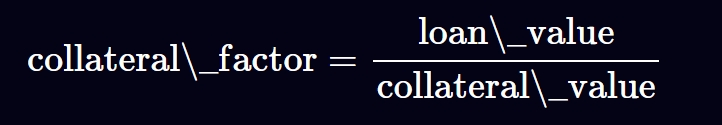
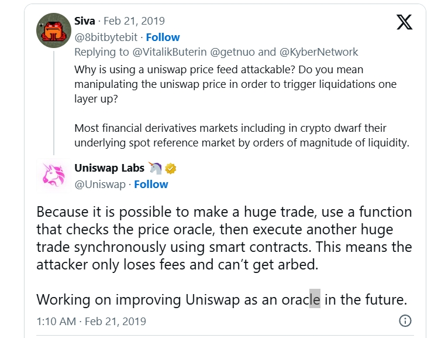

# 价格操纵
## 去中心化借贷
借贷存在两方：`lender` 和 `borrower`, `lender` 借出资产，`borrower` 提供质押物品借出所需资产

比如 `lender` 借出 `10ETH`，那么要求 `borrower` 质押价值 `15ETH` 的代币， 核心在于如何确定 `borrower` 提供的质押物的价值

在去中心的借贷网络中，`lender` 由智能合约充当，数据只能在链上交互，无法和链下真实环境的数据进行交互，因此专门存在和链下数据交互的服务：`Oracle语言机`

`oracle` 预言机表现为链上智能合约，通过抛出事件和定时上传数据的方式保持链下通讯，按照数据源-通常分为：
- 链下中心化预言机
  - 预言机合约的价格数据源于链下，通常由一方控制
  - 预言机合约需要保证数据的快速迭代更新，因此，更新价格的函数权限，通常由 `EOA` 管控，方便快速发送数据更新交易
  - Examples：[compound](https://compound.finance/?ref=samczsun.com) 和 [synthetix](https://synthetix.io/?ref=samczsun.com)
- 链下去中心化预言机
  - 预言机合约的价格数据源于链下，数据由多方管控
  - 预言机合约需要保证数据的快速迭代更新，因此，更新价格的函数权限，通常由 `multi-sig` 控制数，确保数据源的多样性
  - Examples：[Maker](https://makerdao.com/)
- 链上中心化预言机
  - 预言机合约的价格数据源于链上，通常从 `DEX` 中获取实时价格
  - 预言机合约需要保证数据的快速迭代更新，因此，更新价格的函数权限，通常由 `EOA` 管控，只是数据源来源于链上的 `DEX`
  - Exampels: [Nuo](https://nuo.network/?ref=samczsun.com) 和 [dydx](https://dydx.exchange/?ref=samczsun.com)
- 链上去中心化预言机
  - 预言机合约的价格数据源于链上，通常从 `DEX` 中获取实时价格
  - 任何人都可以更新预言机合约中的实时价格数据（存在机制保障价格不会过度浮动）
- 常量预言机
  - 预言机合约数据存储价格常量，通常作为稳定币的价格锚点

## 问题分析

基于公式 (x + r $\Delta x$)(y - $\Delta y$)  = xy 的 `AMM` 在遇到大额兑换单的时候，会猛然提高交易对中 `token1` 的价值，造成获利（三明治夹子原理）

### 解决方案
- 使用链上去中心化预言机获取价格的话，需要制定价格区间滑点，防止价格过度波动

## Reference
[https://www.rareskills.io/post/defi-liquidations-collateral](https://www.rareskills.io/post/defi-liquidations-collateral)

[https://samczsun.com/taking-undercollateralized-loans-for-fun-and-for-profit/](https://samczsun.com/taking-undercollateralized-loans-for-fun-and-for-profit/)