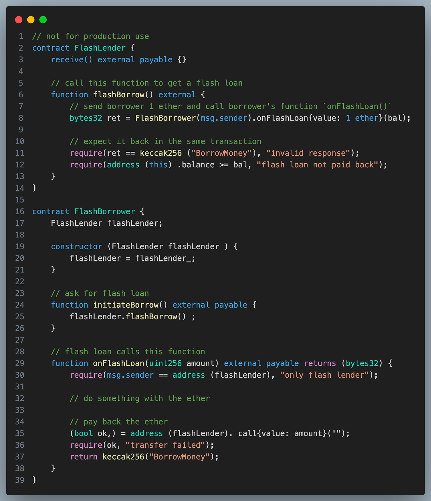
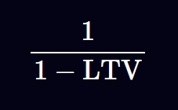
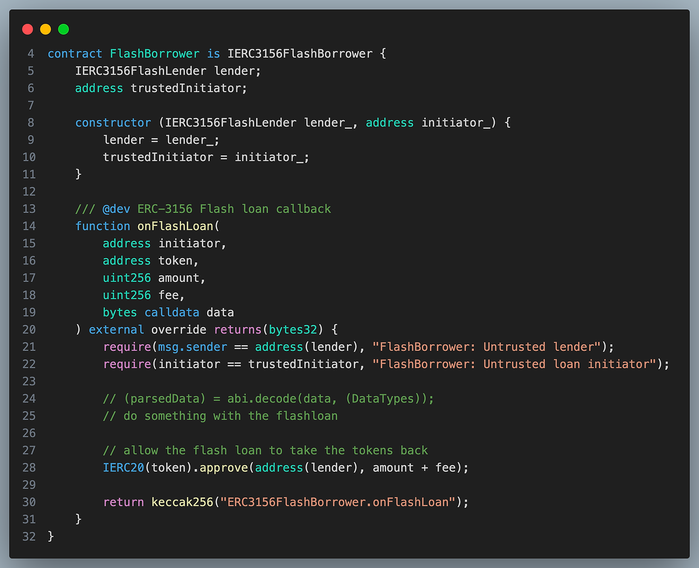
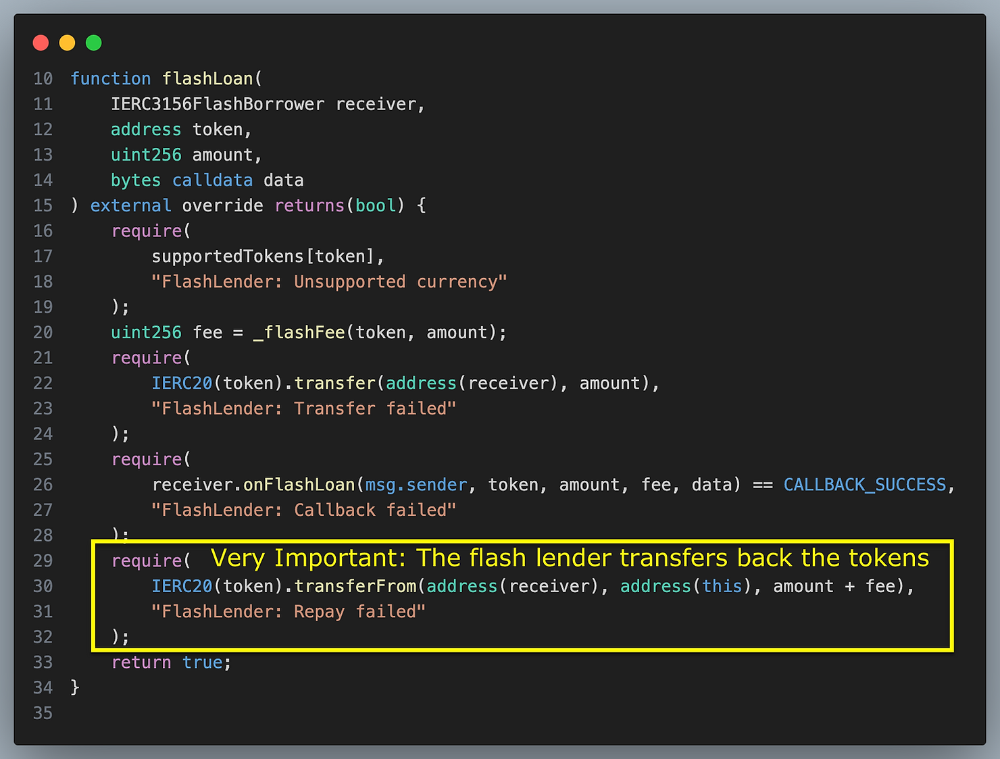

# 闪电贷
闪电贷是智能合约之间的借贷，必须在同一笔交易中偿还。本文介绍了 `ERC3156` 闪电贷规范以及闪电贷出方和借款方可能遭受黑客攻击的方式。最后提供了建议的安全练习。

以下是一个极其简单的闪电贷示例。


如果借款人不偿还贷款，则带有“闪付未还”信息的要求声明将导致整个交易撤销。

## 只有合约才能与闪电贷合作
`EOA` 钱包无法调用 `flashloan()` 函数来获取闪电贷，然后在单笔交易中将代币转回。与闪电贷的集成需要单独的智能合约。

## 闪电贷无需抵押
如果闪电贷能够得到妥善实施，那么就不存在贷款无法偿还的风险，因为一个 `revert` 或失败的 `require` 语句都会导致交易失败，代币就不会转移。

## 闪电贷有何用途？
### 套利
闪电贷最常见的用例是进行套利交易。

例如，如果以太币在一个池子里的交易价格为 `1,200` 美元，而在另一个 `DeFi` 应用程序中的交易价格为 `1,300` 美元，那么最好在第一个池子里购买以太币，然后在第二个池子里卖掉，赚取100美元的利润。但是，你首先需要钱来购买以太币。闪电贷是理想的解决方案，因为你不需要闲置1,200美元。你可以借入1,200美元的以太币，以 1,300美元的价格卖掉，然后偿还1,200美元，为自己保留100美元的利润（减去费用）。

### 再融资贷款
对于常规的 `DeFi` 贷款，它们通常需要某种形式的抵押品。例如，如果您借入 `10,000` 美元的稳定币，则需要存入` 15,000` 美元的以太币作为抵押品。

如果你的稳定币贷款利率为 5%，而你想用另一个利率为 4% 的贷款智能合约进行再融资，你需要

> 用稳定币偿还 10,000 美元 
> 
> 提取 15,000 美元的以太币抵押品 
> 
> 将 15,000 美元的以太币抵押品存入另一个协议 
> 
>以较低的利率再次借入 10,000 美元的稳定币 
> 
>如果您将 10,000 美元用于其他应用程序，那么这将有问题。使用闪电贷，您可以执行步骤 1-4，而无需使用任何自己的稳定币。

## 交换抵押品
在上面的例子中，借款人使用` 15,000` 美元的以太币作为抵押品。但假设该协议使用 `wBTC`（包装比特币）提供较低的抵押率？借款人可以使用闪电贷和上面概述的类似步骤来换出抵押品而不是本金。

## 清算借款人
在 `DeFi` 贷款的背景下，如果抵押品跌破某个阈值，那么抵押品就会被清算——强制出售以支付贷款成本。

> 在上面的例子中，如果以太币的价值跌至 `12,000` 美元，那么协议可能会允许某人以 `11,500` 美元的价格购买以太币，前提是他们先偿还 `10,000` 美元的贷款。
>
> 清算人可以使用闪电贷来偿还 `10,000` 美元的稳定币贷款，并用 `11,500` 美元的价格购入以太币。
>
> 然后他们会在另一个交易所将其出售以获得稳定币，然后偿还闪电贷。

## 在单笔交易中构建杠杆循环
通过使用借贷协议，人们可以实现杠杆多头和空头。

例如，要杠杆做多 `ETH`，用户可以将 `ETH` 作为抵押品存入借贷池，借入稳定币，然后将稳定币换成 `ETH`，然后将 `ETH` 存入借贷池并不断重复该过程。 抵押品和借入 `ETH` 的总规模将大于原始金额，从而使借款人能够更多地参与 `ETH` 的价格。

要利用杠杆做空 `ETH`，用户可以将稳定币存入借贷池，借入 `ETH`，将 `ETH` 换成稳定币，然后将稳定币存入借贷池并不断重复该过程。现在用户有大量 `ETH` 债务，如果 `ETH` 价格下跌，偿还起来会更容易。

以这种方式可以借入的资产总额为



`LTV` 是协议将接受的最大贷款价值比。

例如，如果协议要求存入价值 `1000` 美元的稳定币才能借入 `800` 美元的 `ETH`，那么 `LTV` 就是 `800/1000 = 0.8`

你可以

> 使用闪电贷借入价值 5,000 美元的稳定币
>
> 将稳定币兑换为价值 5,000美元的 ETH
> 
> 将 ETH 放入借贷池作为抵押品
> 
> 从借贷池借入价值 4,000美元的稳定币
> 
> 用他们从借贷池中借入的 4,000美元稳定币加上他们自己的 1,000美元稳定币，偿还闪电贷。
> 
> 现在用户拥有价值 5,000美元的 ETH 作为抵押品
> 
> 也就是说，用户可以用 1000美元的存款敞口投资价值 5000美元的 ETH 。

## 破解智能合约
闪电贷最出名的可能是被黑帽黑客用来利用协议。

闪电贷的主要攻击媒介是价格操纵和治理（投票）操纵。在防御不足的 `DeFi` 应用程序上使用，闪电贷允许攻击者大量购买资产以提高其价格，或获取大量投票代币以推动治理提案。

## ERC3156 闪电贷 协议
`ERC3156` 旨在标准化闪电贷的接口

### ERC3156 Borrower
标准第一点是借款人需要实现的接口，如下所示，借款人只需要实现一个函数即可：
```solidity
// SPDX-License-Identifier: MIT
// OpenZeppelin Contracts (last updated v5.1.0) (interfaces/IERC3156FlashBorrower.sol)

pragma solidity ^0.8.20;

/**
 * @dev Interface of the ERC-3156 FlashBorrower, as defined in
 * https://eips.ethereum.org/EIPS/eip-3156[ERC-3156].
 */
interface IERC3156FlashBorrower {
    /**
     * @dev Receive a flash loan.
     * @param initiator The initiator of the loan.
     * @param token The loan currency.
     * @param amount The amount of tokens lent.
     * @param fee The additional amount of tokens to repay.
     * @param data Arbitrary data structure, intended to contain user-defined parameters.
     * @return The keccak256 hash of "ERC3156FlashBorrower.onFlashLoan"
     */
    function onFlashLoan(
        address initiator,
        address token,
        uint256 amount,
        uint256 fee,
        bytes calldata data
    ) external returns (bytes32);
}
```
#### initiator
构造借贷交易的地址，应该就是本合约的地址，应该再合约内部执行校验。

`onFlashLoan()` 因为该函数是 `external` 修饰，任何人都可以调用它，因此需要保证该函数不会被恶意调用。

> 如果不判断 `initiator == address(this)` 的话
> 
> 任何地址可以直接调用 lender 合约的 flashloan() 函数
> 
> 将该 `borrower`  作为 receiver 参数
> 
> `Flashloan()` 将会在每次被调用的时候，收入 `borrower` 合约的手续费
> 
> 最终榨干 `borrower` 的余额

#### 令牌
这是您要借入的 `ERC20` 代币的地址。提供闪电贷的合约通常会持有多个可以闪电贷出的代币。`ERC3156` 闪电贷标准不支持闪电贷出原生 `Ether`，但这可以通过闪电贷出 `WETH` 并让借款人解开 `WETH` 来实现。由于借款合约不一定是调用闪电贷出者的合约，因此可能需要告知借款合约正在闪电贷出哪种代币。

#### 费用
费用是需要支付多少代币作为借贷费用。它以绝对金额表示，而不是百分比。

#### 数据
如果您的闪电贷接收合约没有硬编码为在接收闪电贷时采取特定操作，则您可以使用 `data` 参数来参数化其行为。例如，如果您的合约是套利交易池，那么您可以指定与哪些池进行交易。

#### 返回值
调用最终应该返回 `keccak256("ERC3156FlashBorrower.onFlashLoan")`

#### ERC3156 Borrower 实施方案
这已从 `ERC3156` 规范中的代码进行了修改，以使代码片段更小。请注意，此合约仍然完全信任闪电借出方。如果闪电借出方以某种方式受到损害，则可以通过向其提供虚假数据来利用以下合约


### ERC3156 Lender
#### 标准规范
```solidity
// SPDX-License-Identifier: MIT
// OpenZeppelin Contracts (last updated v5.1.0) (interfaces/IERC3156FlashLender.sol)

pragma solidity ^0.8.20;

import {IERC3156FlashBorrower} from "./IERC3156FlashBorrower.sol";

/**
 * @dev Interface of the ERC-3156 FlashLender, as defined in
 * https://eips.ethereum.org/EIPS/eip-3156[ERC-3156].
 */
interface IERC3156FlashLender {
    /**
     * @dev The amount of currency available to be lended.
     * @param token The loan currency.
     * @return The amount of `token` that can be borrowed.
     */
    function maxFlashLoan(address token) external view returns (uint256);

    /**
     * @dev The fee to be charged for a given loan.
     * @param token The loan currency.
     * @param amount The amount of tokens lent.
     * @return The amount of `token` to be charged for the loan, on top of the returned principal.
     */
    function flashFee(address token, uint256 amount) external view returns (uint256);

    /**
     * @dev Initiate a flash loan.
     * @param receiver The receiver of the tokens in the loan, and the receiver of the callback.
     * @param token The loan currency.
     * @param amount The amount of tokens lent.
     * @param data Arbitrary data structure, intended to contain user-defined parameters.
     */
    function flashLoan(
        IERC3156FlashBorrower receiver,
        address token,
        uint256 amount,
        bytes calldata data
    ) external returns (bool);
}
```

该 `flashLoan()` 函数需要完成几个重要的操作：

有人可能会 `flashLoan()` 使用闪电贷合约不支持的代币进行调用。应检查这一点。

有人可能会 `flashLoan()` 跟注金额大于 `maxFlashLoan`。 这也应该检查 

`data` 只是转发给 `caller` 执行。

更重要的是，`flashLoan()` 必须将代币转给接收者，然后再转回。


请注意，参考实现假设 ERC20 代币在成功时返回 `true`，但并非所有代币都如此，因此如果使用不兼容的 `ERC20` 代币，请使用 `SafeTransfer` 库。
## 安全注意事项
### Borrower的访问控制和输入验证
`Borrower` 贷款合约必须有控制措施，只允许 `lender` 借款合约调用 `onFlashLoan()`

否则，其余参与者也可以调用 `onFlashLoan()` 并导致意外行为。

此外，再`lender` 借款合约中，任何人都可以调用` flashloan()`函数，任意指定 `Borrower` 贷款合约并传递任意数据。为了确保数据不是恶意的，闪电贷接收方合约应该只允许一组有限的调用者地址。

### 重入锁非常重要
`ERC3156` 从定义上来说不能遵循检查效果模式来防止重入。它必须通知借款人它已经收到了代币（进行外部调用），然后将代币转回。因此，`nonReentrant` 应该在合约中添加锁定。

### 将借出代币转回
`Lender` 借款合约应该在确认`Borrower`贷款地址收到代币并执行一系列逻辑后，将代币转回借款合约

贷方将代币从借方转回，借方并不会主动将代币转回。

在使用 `balanceOf(address(this))` 进行判断代币是否回流的时候，这对于避免“侧入”很重要，即借方以贷方的身份将钱存入协议。现在，资金池看到其余额已恢复到以前的水平，但借方突然变成了拥有大量存款的贷方。

`UniswapV2` 的闪电贷在贷款结束后不会将代币转回。但是，它使用重入锁来确保借款人不能像贷款人一样将贷款存回协议来“偿还贷款”。

### 确保onFlashLoan调用的交易发起者是 borrower合约地址
`Lender`闪电贷款人地址被硬编码为仅调用接收方的 `onFlashLoan()` 函数而不调用其他函数。

如果借款人有办法指定闪电贷款人将调用哪个函数，那么闪电贷款就可以被操纵，将其持有的其他代币转移（通过调用`ERC20.transfer`）或批准将其代币余额转移到恶意地址。

因为这样的操作需要明确调用 `ERC20transfer` 或 `approve`，所以如果闪电贷出者只能调用，这种情况就不会发生 `onFlashLoan()`。

### 使用 token.balanceOf(address(this)) 可以进行操作
在上面的实现中，我们没有使用 `balanceOf(address(this))`  来确定最大闪电贷规模。

其他人可以直接将代币转移到合约中，从而干扰逻辑，从而改变这一点。

我们知道闪电贷已偿还的方式是因为贷方将贷款金额 + 费用转回。

有效的方法来 `balanceOf(address(this))` 检查还款情况，但这必须与重入检查相结合，以避免将贷款作为押金偿还。

### 为什么闪电借款人需要返回 keccak256(“ERC3156FlashBorrower.onFlashLoan”);
这处理了 `Borrower` 合约不存在 `onFlashLoan()` 函数，仅仅在 `fallback()` 中执行批准闪电贷出合约的情况。有人可以反复以该合约为接收者发起闪电贷。然后会发生以下情况：

> 受害合约获得闪电贷 
> 
> 受害者合约被调用onFlashLoan(),但是仅触发 fallback 函数。 
> 
> 闪电贷出方从借款方提取代币+手续费

如果此操作循环发生，则具有 `fallback()` 功能的受害合约将被耗尽。 `EOA` 钱包也可能发生同样的情况，因为使用 `onFlashLoan` 调用钱包地址不会 `revert`。

仅检查函数 `onFlashLoan` 是否 `revert` 是不够的。闪电借出方还会检查返回值 `keccack256("ERC3156FlashBorrower.onFlashLoan")` 是否已返还，以便了解借款人是否打算借入代币并偿还费用。
