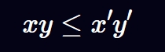
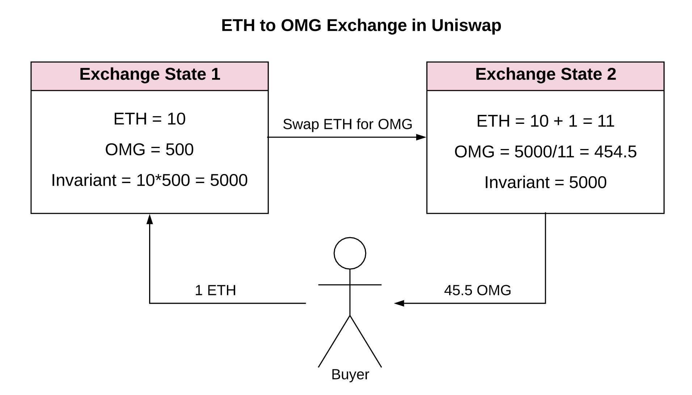

# 恒定函数做市商 (Constant Function Market Makers)

> 本章节主要讲述了 [Uniswap V1白皮书](https://github.com/Uniswap/docs/tree/main/docs/contracts/v1)中的内容. 理解其中的数学原理能帮助你更好地构建像 Uniswap 这样的应用, 不过如果你没有完全理解本章全部内容也没关系。

正如我们在上一节中提到的那样，`AMM` 的构建有许多不同的方法。我们将主要关注与构建一种特定的 AMM：恒定函数做市商（有时也被称为恒定乘积做市商）。尽管名字听起来很复杂，但是它的核心数学原理只是一个非常简单的公式：

$$x * y = k$$

仅此而已，这就是 `AMM`.

$x$ 和 $y$ 是池子合约所拥有的两种资产的数目。$k$ 是它们的乘积，我们暂时不考虑它的实际值等于多少。

> **为什么只有两种资产*x*和*y*？**
每个 Uniswap 的池子仅包含两种 资产。我们使用 *x* 和 *y* 来表示一个池子中的两种资产，其中 *x* 代表第一个 token，*y* 代表第二个 token。两种 token 的顺序（暂时）并不重要。

恒定函数做市商的原理是：**在每次交易后，*k* 必须保持不变**。当用户进行交易，他们通常将一种类型的 `token` 放入池子（也即他们打算卖出的 `token` ），并且将另一种类型的 `token` 移出池子（也即打算购买的 `token`）。这笔交易会改变池子中两种资产的数量，而上述原理表示，两种资产数目的**乘积**必须保持不变。我们之后还会在本书中看到许多次这个原理，这就是 `Uniswap` 的核心机制。

AMM 自动做市商合约内部持有交易对，允许交易对代币之间互相兑换，需要注意的是每次交易兑换都会收取相应的手续费，因此，每笔交易都会推高 k 值：

其中，xy表示兑换执行前的代币交易对数量

x' y' 表示兑换执行后的代币交易对数量

下面我们来看一个更加具体的例子:
1. 起始价格为 `50(10 ETH  = 500 OMG)`，
2. 我们卖出 `1` 个 `ETH`，手续费收取 3 %
3. 如果我们仅以现货价格计算，计算能够获得的 `OMG`
- （10 + 1*（1-3%））* （500 - dy） = 10 * 500
- dy = 44.21，交易实际发生的价格是 `44.21`
4. 此时：
- 交易池子中新增 1 ETH， 总量为 10 + 1 = 11 ETH
- 交易池子中减少44.21 OMG，总量为 500 - 44.21 = 455.79 OMG
- 兑换后后池子总流动性为： 11 * 455.79 = 5013.69
- 由于收续费的原因，兑换后的流动性大于兑换之前的 5000

因此，每次兑换都会推高总流动性的值，早期提供流动性代币的用户就会获利

## 交易函数
现在我们知道了什么是池子以及交易的原理，接下来我们写一下交易发生时的公式：

(x + $\Delta x$)(y - $\Delta y$) = k

1. 一个池子包含一定数量的 `token0` ($x$) 和一定数量的 `token1` ($y$)
2. 当我们用 `token0` 购买 `token1` 的时候，一些 `token0` 被放入池子 ($\Delta x$)
3. 这个池子将给我们一定数量的 `token1` 作为交换 ($\Delta y$)
4. 池子也会从我们给出的 `token0` 中收取一定数量的手续费 ($r$)
5. 池子中 `token0` 的数量发生了变化 ($x + r \Delta x$)， `token1` 的数量也发生了变化 ($y - \Delta y$)
6. 二者的乘积保持不变，仍然为 $k$

> 我们使用 token0 和 token1 这样的表述，是为了与代码保持一致。现在，两个 token 的顺序并不重要。

简单来说，我们给了池子一定数量的 `token0`，然后获得了一定数量的 `token1`。这个池子的工作就是按照一个合理的价格，给予我们正确数量的 token1。我们可以得出以下结论：**池子决定了交易的价格**。

## 价格

池子里 `token` 的价格是如何计算的？

由于 Uniswap 不同的池子对应不同的智能合约，**同一个池子里的两种 token 互为计价标准进行定价**。例如：在一个 ETH/USDC 的池子里，ETH 的价格用 USDC 作为标定，而 USDC 的价格用 ETH 作为标定。假设一个 ETH 的价格是1000 USDC，那么一个 USDC 的价格就是 0.001 ETH。每一个池子都是如此，无论 token 是否为稳定币（例如，ETH/BTC 池）

在现实世界中，价格是根据[供求关系](https://www.investopedia.com/terms/l/law-of-supply-demand.asp)来决定的，对于 AMM 当然也是如此，现在，我们先不考虑需求方，只关注供给方。

池子中 `token` 的价格是由 `token` 的供给量决定的，也即**池子中拥有该 `token` 的资产数目**。`token` 的价格公式如下：

$$P_x = \frac{y}{x}, \quad P_y=\frac{x}{y}$$

其中 $P_x$ 和 $P_y$ 是一个 `token` 相对于另一个 `token` 的价格

这个价格被称作 *现货价格/现价*， 它反映了当前的市场价。然而，交易实际成交的价格却并不是这个价格。现在我们再重新把需求方纳入考虑：

根据供求关系，**需求越高，价格越高**，这也是我们应当在去中心化交易中满足的性质。我们希望当需求很高的时候价格会升高，并且我们能够用池子里的资产数量来衡量需求：你希望从池子中获取某个token的数量越多，价格变动就越剧烈。我们再重新考虑上面这个公式：

(x + r $\Delta x$)(y - $\Delta y$)  = xy

从这个公式中，我们能够推导出关于 $\Delta x$ 和 $\Delta y$ 的式子，这也意味着我们能够通过交易付出的 `token` 数目来计算出获得的 token 数目，反之亦然：

$$\Delta y = \frac{y r \Delta x}{x + r \Delta x}$$
$$\Delta x = \frac{x \Delta y}{r(y - \Delta y)}$$

这些公式就能够让我们重新计算价格。我们能够从 $\Delta y$ 公式中求出获得 `token` 数量（当我们希望卖出 `token` 的数量为定值），并且从 $\Delta x$ 的公式中求出需要提供的 `token` 数量（当我们购买 `token` 的数量为定值）。注意到，这里的公式是资产之间的关系，同时也把交易的数量(第一个公式中的 $\Delta x$ 和第二个公式中的 $\Delta y$)加入了计算。**这是同时考虑了供求双方的价格函数**。事实上，我们甚至并不需要去计算价格！（因为我们直接计算出了交易的结果）

> 下面是从交易函数推导出上述价格函数的过程:
$$(x + r\Delta x)(y - \Delta y) = xy$$

$$y - \Delta y = \frac{xy}{x + r\Delta x}$$

$$-\Delta y = \frac{xy}{x + r\Delta x} - y$$

$$-\Delta y = \frac{xy - y({x + r\Delta x})}{x + r\Delta x}$$

$$-\Delta y = \frac{xy - xy - y r \Delta x}{x + r\Delta x}$$

$$-\Delta y = \frac{- y r \Delta x}{x + r\Delta x}$$

$$\Delta y = \frac{y r \Delta x}{x + r\Delta x}$$
以及:
$$(x + r\Delta x)(y - \Delta y) = xy$$

$$x + r\Delta x = \frac{xy}{y - \Delta y}$$

$$r\Delta x = \frac{xy}{y - \Delta y} - x$$

$$r\Delta x = \frac{xy - x(y - \Delta y)}{y - \Delta y}$$

$$r\Delta x = \frac{xy - xy + x \Delta y}{y - \Delta y}$$

$$r\Delta x = \frac{x \Delta y}{y - \Delta y}$$

$$\Delta x = \frac{x \Delta y}{r(y - \Delta y)}$$

## 曲线

上面的数学计算可能有些抽象和枯燥，下面我们来把恒定乘积函数进行可视化来更好地理解其工作原理

恒定成绩函数的图像为二次双曲线：

横纵轴分别表示池子中两种代币的数量。每一笔交易的起始点都是曲线上与当前两种代币比例相对应的点。为了计算交易获得的 `token` 数量，我们需要找到曲线上的一个新的点，其横坐标值为 $x+\Delta x$，也即池子中现在 `token0` 的数量加上我们卖出的数量。y 轴上的变化量就是我们将会获得的 `token1` 的数量。

下面我们来看一个更加具体的例子:

1. 紫色的线是公式代表的双曲线，横纵坐标轴代表池子中代币资产的数目（注意到在一开始，两种代币的数量相等）
2. 起始价格为 `50(1 ETH  = 50 OMG)`
3. 我们卖出 `1` 个 `ETH`，如果我们仅以现货价格计算，我们希望获得 `50` 个 `OMG`。
4. 然而，交易实际发生的价格是 `45.5`，所以我们仅仅获得了 `45.5` 个 `OMG`！

这个例子来源于[the Desmos chart](https://www.desmos.com/calculator/7wbvkts2jf)，作者是[Dan Robinson](https://twitter.com/danrobinson),
`Uniswap` 的创始人之一。 为了能够更直观地理解它是如何工作的，你可以尝试自己构建不同的场景并且在图上画出来。试一试不同的资产数目，观察当 $\Delta x$ 远小于 $x$ 时获得代币的数量。

> 一个很传奇的故事是，Uniswap 就是在 Desmos 中发明出来的.

你或许在想，为什么要用这样的一个曲线？这个曲线看起来好像是在惩罚大额交易者。事实上，的确就是如此，并且这也是一个非常好的性质！供求关系告诉我们，当需求很高的时候（假设供给保持不变），价格也同样很高；当需求低的时候，价格也仍然很低。这正是市场的工作原理。并且很神奇地是，这样一个恒定乘积函数恰好实现了这个机制！需求就是你希望购买 `token` 的数量，而供给就是池子中的资产。当你希望购买的数量占池子的一个很大比例，价格就会比你购买小数量时更高。这样一个简单的公式，恰恰保证了这么一个强大的机制。

尽管 `Uniswap` 并不计算交易价格，我们仍然能够从曲线上看到它。事实上，在一笔交易中我们有很多个价格：
1. 在交易前，有一个*现货价格*。这个价格等于池子中两种资产的比例，$y/x$ 或者 $x/y$，取决于你交易的方向。这个价格也是起始点*切线的斜率*。
2. 在交易后，有一个新的现货价格，在曲线上另一个不同的点。这个价格是新的点的切线斜率。
3. 这个交易的实际发生价格，是连接新旧点的这条线的斜率。

**这就是 `UniswapV1/V2` 里用到的全部数学！**
