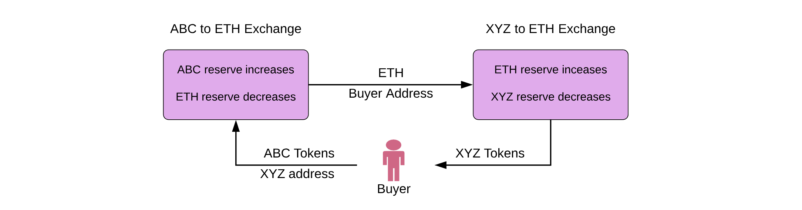

# Uniswap V1
## 背景介绍
- `UniswapV1 pool` 只允许创建 `Token/ETH` 交易对
  - 流动性代币实际就是 `ERC20` 代币，支持转账
  - 交易池支持直接的 `Token/ETH` 计算兑换
  - `Token/Token` 之间的兑换需要不同的交易池参与，以 `ETH` 为锚点执行兑换
## Exchange
任何人通过提供 `ETH/ERC20` 代币提供流动性，流动性代币在提供流动性时 `mint`,在退款时 `burn`
### 增加流动性
  - public: [[addLiquidity(min_liquidity: uint256, max_tokens: uint256, deadline: timestamp)](https://github.com/Uniswap/v1-contracts/blob/master/contracts/uniswap_exchange.vy#L48)]
  - 初次添加流动性：
    - `ETH/Token` 直接作为交易对存储在池子
    - `ETH` 余额就是当前池子的流动性代币数量
  - 非初次添加流动性：
    - 以用户提供的 `ETH` 为锚点，计算应该提供的相匹配的 `Token` 数量和 `mint` 出来的流动性代币数量
    - 用户自定义的滑点控制交易，确保 `Token` 数量不会超限
    - 确保最终流动性代币的数量不会过低
```solidity
@public
@payable
def addLiquidity(min_liquidity: uint256, max_tokens: uint256, deadline: timestamp) -> uint256:
    assert deadline > block.timestamp and (max_tokens > 0 and msg.value > 0)
    total_liquidity: uint256 = self.totalSupply
    if total_liquidity > 0:
// 允许用户自定义滑点，确保最终获得的流动性在滑点范围内
        assert min_liquidity > 0
// 当前池子交易对中的ETH数量
        eth_reserve: uint256(wei) = self.balance - msg.value
// 当前池子交易对中的Token数量
        token_reserve: uint256 = self.token.balanceOf(self)
// 按照当前交易提供的 ETH 数量 和池子余额来计算应该添加的Token数量，数值向上取整
// 要求匹配的Token 数量小于用户自定义的Token最大值
        token_amount: uint256 = msg.value * token_reserve / eth_reserve + 1
// 按照当前交易提供的 ETH数量 和目前池子中的流动性代币数量来计算最终获得的流动性，数值向下取整
// 要求最终流动性的值大于用户期望的最小值
        liquidity_minted: uint256 = msg.value * total_liquidity / eth_reserve
        assert max_tokens >= token_amount and liquidity_minted >= min_liquidity
// mint 流动性代币
        self.balances[msg.sender] += liquidity_minted
        self.totalSupply = total_liquidity + liquidity_minted
// 将Token代币添加到流动池
        assert self.token.transferFrom(msg.sender, self, token_amount)
// 抛出事件
        log.AddLiquidity(msg.sender, msg.value, token_amount)
        log.Transfer(ZERO_ADDRESS, msg.sender, liquidity_minted)
        return liquidity_minted
    else:
// 初次添加流动性
// 判断当前工厂合约、Token合约的合法性
// 初次添加流动性，要求最少的ETH数量为 1 GWEI
        assert (self.factory != ZERO_ADDRESS and self.token != ZERO_ADDRESS) and msg.value >= 1000000000
// 判断交易池的合约地址，只能添加当前池子Token代币
        assert self.factory.getExchange(self.token) == self
// 初次添加流动性时，将全部代币转入流动性池
        token_amount: uint256 = max_tokens
// 初次添加流动性时，将ETH转账额作为Token的初始交易对。
// ETH 初次额度就是当前交易池的流动性
        initial_liquidity: uint256 = as_unitless_number(self.balance)
        self.totalSupply = initial_liquidity
// 将流动性代币 mint 到交易发送地址
        self.balances[msg.sender] = initial_liquidity
// 将Token代币添加到交易池
        assert self.token.transferFrom(msg.sender, self, token_amount)
// 抛出事件
        log.AddLiquidity(msg.sender, msg.value, token_amount)
        log.Transfer(ZERO_ADDRESS, msg.sender, initial_liquidity)
        return initial_liquidity
```
### 移除流动性
- public: [[removeLiquidity(amount: uint256, min_eth: uint256(wei), min_tokens: uint256, deadline: timestamp)](https://github.com/Uniswap/v1-contracts/blob/master/contracts/uniswap_exchange.vy#L83C5-L83C102)]
- 移除流动性
  - 以用户提供的流动性代币数量为锚点，计算应该退还的`ETH和Token`数量
  - 用户自定义滑点，确保退换的 `ETH 和 Token` 满足用户期望
```solidity
@public
def removeLiquidity(amount: uint256, min_eth: uint256(wei), min_tokens: uint256, deadline: timestamp) -> (uint256(wei), uint256):
    assert (amount > 0 and deadline > block.timestamp) and (min_eth > 0 and min_tokens > 0)
    total_liquidity: uint256 = self.totalSupply
    assert total_liquidity > 0
// 交易池中Token的总数量
    token_reserve: uint256 = self.token.balanceOf(self)
// 根据移除的流动性代币数量占据总流动性的比例，计算池子中应该退回的ETH数量
    eth_amount: uint256(wei) = amount * self.balance / total_liquidity
// 根据移除的流动性代币数量占据总流动性的比例，计算池子中应该退回的Token数量
    token_amount: uint256 = amount * token_reserve / total_liquidity
//根据用户自定义的滑点，确保退换的ETH 和 Token在可接受的范围内
    assert eth_amount >= min_eth and token_amount >= min_tokens
// 去除流动性
    self.balances[msg.sender] -= amount
    self.totalSupply = total_liquidity - amount
// 退还 ETH
    send(msg.sender, eth_amount)
// 退还Token代币
    assert self.token.transfer(msg.sender, token_amount)
// 抛出事件
    log.RemoveLiquidity(msg.sender, eth_amount, token_amount)
    log.Transfer(msg.sender, ZERO_ADDRESS, amount)
    return eth_amount, token_amount
```
### 根据交易池输入计算输出
$$\Delta y = \frac{y r \Delta x}{x + r \Delta x}$$

`UniswapV1` 交易会抽取0.3%的手续费，作为提供流动性的奖励（计算恒定乘积的时候扣除手续费，但是交易池整体的余额增加，导致整体的乘积上涨,每笔交易都会让恒定乘积上涨。)

private: [[getInputPrice(input_amount: uint256, input_reserve: uint256, output_reserve: uint256)](https://github.com/Uniswap/v1-contracts/blob/master/contracts/uniswap_exchange.vy#L106C5-L106C90)]
```solidity
@private
@constant
def getInputPrice(input_amount: uint256, input_reserve: uint256, output_reserve: uint256) -> uint256:
    assert input_reserve > 0 and output_reserve > 0
// 输入的资产需要扣除一部分手续费
    input_amount_with_fee: uint256 = input_amount * 997
    numerator: uint256 = input_amount_with_fee * output_reserve
    denominator: uint256 = (input_reserve * 1000) + input_amount_with_fee
    return numerator / denominator
```
### 根据交易池输出反推输入
$$\Delta x = \frac{x \Delta y}{r(y - \Delta y)}$$

private: [[getOutputPrice(output_amount: uint256, input_reserve: uint256, output_reserve: uint256)](https://github.com/Uniswap/v1-contracts/blob/master/contracts/uniswap_exchange.vy#L120C5-L120C92)]

```solidity
@private
@constant
def getOutputPrice(output_amount: uint256, input_reserve: uint256, output_reserve: uint256) -> uint256:
assert input_reserve > 0 and output_reserve > 0
numerator: uint256 = input_reserve * output_amount * 1000
denominator: uint256 = (output_reserve - output_amount) * 997
return numerator / denominator + 1
```
### 多个交易池兑换Token
private: [[tokenToTokenInput(tokens_sold: uint256, min_tokens_bought: uint256, min_eth_bought: uint256(wei), deadline: timestamp, buyer: address, recipient: address, exchange_addr: address)](https://github.com/Uniswap/v1-contracts/blob/master/contracts/uniswap_exchange.vy#L271C5-L271C183)]

用户进行 `Token-Token` 的 `Swap`，根据不同交易池的 `ETH` 锚定数量



```solidity
@public
def tokenToEthTransferOutput(eth_bought: uint256(wei), max_tokens: uint256, deadline: timestamp, recipient: address) -> uint256:
    assert recipient != self and recipient != ZERO_ADDRESS
    return self.tokenToEthOutput(eth_bought, max_tokens, deadline, msg.sender, recipient)

@private
def tokenToTokenInput(tokens_sold: uint256, min_tokens_bought: uint256, min_eth_bought: uint256(wei), deadline: timestamp, buyer: address, recipient: address, exchange_addr: address) -> uint256:
    assert (deadline >= block.timestamp and tokens_sold > 0) and (min_tokens_bought > 0 and min_eth_bought > 0)
    assert exchange_addr != self and exchange_addr != ZERO_ADDRESS
    token_reserve: uint256 = self.token.balanceOf(self)
// 通过输入计算预期输出
// 卖出TokenA,计算预期的ETH数量
    eth_bought: uint256 = self.getInputPrice(tokens_sold, token_reserve, as_unitless_number(self.balance))
    wei_bought: uint256(wei) = as_wei_value(eth_bought, 'wei')
    assert wei_bought >= min_eth_bought
    assert self.token.transferFrom(buyer, self, tokens_sold)
// 根据卖出的ETH，购入TokenB
    tokens_bought: uint256 = Exchange(exchange_addr).ethToTokenTransferInput(min_tokens_bought, deadline, recipient, value=wei_bought)
    log.EthPurchase(buyer, tokens_sold, wei_bought)
    return tokens_bought
```
## Reference
- https://hackmd.io/C-DvwDSfSxuh-Gd4WKE_ig
- https://github.com/Uniswap/v1-contracts/blob/master/contracts/uniswap_exchange.vy