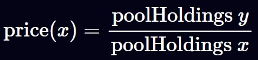

# 恒定函数做市商 (Constant Function Market Makers)

## AMM 机制
### 无订单簿
AMM 基于公式 `x * y = k` 运行交易池，通过内部代币的数量决定兑换价格

价格总是跟内部代币的数量相关，当单一交易池的代币价格脱锚后，其它 DEX 可以通过套利平衡每个交易池的价格

### 天然Oracle
DEX 的代币价格总是和池子中的代币数量相关，因此可以作为链上代币价格的语言机。

但是，DEX的价格容易受到链上交易的影响，flash_loan 的大量代币的涌入/涌出 会造成代币瞬时的巨额波动，因此使用AMM 去中心化交易池子作为 价格 oracle 需要谨慎考虑价格的波动性

### 价格波动
AMM DEX 中任意交易都会引起兑换价格的波动，

## Reference
- https://www.rareskills.io/category/defi
- https://www.rareskills.io/uniswap-v2-book
- https://github.com/Uniswap/docs/tree/main/docs/contracts/v2